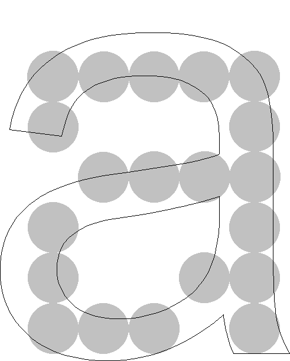
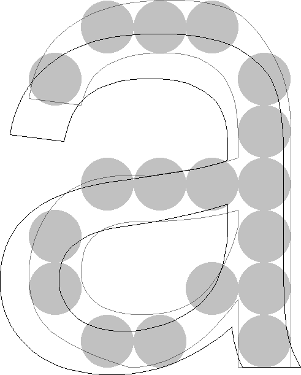

import Margin from 'gatsby-theme-signalwerk/src/components/Margin';
import Grid from 'gatsby-theme-signalwerk/src/components/Grid';
import Column from 'gatsby-theme-signalwerk/src/components/Column';
import Box from 'gatsby-theme-signalwerk/src/components/Box';


<Margin>


### Inhaltsverzeichnis
```toc
exclude:
  - Inhaltsverzeichnis
from-heading: 2
to-heading: 2
```

</Margin>


## Darstellung von Fonts

### Vektor zu Pixel
Heutige Fonts bestehen meist aus Vektor-Daten, die dann für die Anzeige an einem Ausgabegerät in eine Pixel-Matrix umgesetzt werden müssen. Diese Umrechnung von Vektoren zu Pixel kann auf verschiedene Arten geschehen. Die dafür zuständige Software wird Renderer genannt und ist je nach Hersteller unterschiedlich und liefert für die selben Vektoren unterschiedliche Ergebnisse.

### Grösse in Pixel
Die Darstellungsgrösse einer Schrift wird in PPM (pixels per em) gemessen. Also wie viele Pixel das Geviert (vertikaler Raumbedarf) einnimmt. Wird also ein Font auf eine Schriftgrösse von 20 Pixel eingestellt, so ist der vertikale Raumbedarf 20 Pixel hoch. Das effektive Schriftbild (Schwärzung) ist jedoch im allgemeinen kleiner und von Schrift zu Schrift verschieden. Siehe [Fonts · Eigenschaften](../font-anatomy/).
Eine Fontdatei hat intern ein ein Koordinatensystem, welches sich in Einheiten pro Geviert berechnet bei PostScript-basierten Schriften ist dies meist 1000 UPM (units per em) und bei TrueType-basierten Schriften meist 2048 UPM.


<Grid class="img--upscale">


<Column start="1" end="7">


<Box maxWidth="70">


</Box>


<br/>

#### Font als Outline
Microsoft Arial Unicode


<small>Darstellung aus FontLab</small>

</Column>

<Column start="7" end="13">


<Box maxWidth="70">




</Box>

<br/>

#### 12 Pixel Höhe (PPM) – S/W
Gerendert werden alle Pixel die zu mindestens
50% innerhalb der Kontur liegen (ohne Hinting).

<small>Darstellung aus FontLab</small>


</Column>

</Grid>


### Auflösung
Je höher die Auflösung eines Buchstaben ist, um so klarer nähert sich die Pixel-Darstellung an die Vektorform an.
Eine höhere Auflösung pro Buchstabe kann erreicht werden, indem die Grösse des Buchstabens oder die Auflösung des Ausgabegeräts erhöht wird.


<Grid class="img--upscale-pixelated">


#### 8 bis 48 Pixel Höhe (PPM)
Microsoft Arial Unicode – MS-Renderer – S/W


</Grid>


## Darstellung ohne Graustufen


Bei kleinen Schriften oder aber bei gewissen Display-Technologien kann es sinnvoll sein, Schrift nur mit S/W darzustellen.


<Grid className="img--upscale-pixelated">


<br />

#### 8 Pixel Höhe (PPM)
Microsoft Arial Unicode – MS-Renderer – S/W

</Grid>


<Grid className="img--upscale-pixelated">


<br />

#### 24 Pixel Höhe (PPM)
Microsoft Arial Unicode – MS-Renderer – S/W

</Grid>


<Box  maxWidth="70" className="img--upscale-pixelated">


</Box>

<br />


#### 8 bis 18 Pixel Höhe (PPM)
Microsoft Arial Unicode – MS-Renderer – S/W  


### Unterschiede im Rendering
Bei der S/W-Darstellung von Schrift sind die Unterschiede zwischen verschiedenen Renderern viel weniger stark erkennbar als bei einer Darstellung mit Graustufen.


<Grid  className="img--upscale-pixelated">


<Column start="1" end="5">


<Box maxWidth="70">


</Box>


<br />

#### FreeType-Renderer – S/W
13 Pixel Höhe (PPM) – Microsoft Arial Unicode

</Column>
<Column start="5" end="9">

<Box maxWidth="70">


</Box>


<br />


#### MS-Renderer – S/W
13 Pixel Höhe (PPM) – Microsoft Arial Unicode


</Column>
<Column start="9" end="13">


<Box maxWidth="70">


</Box>

<br />


#### Apple-Renderer – S/W
13 Pixel Höhe (PPM) – Microsoft Arial Unicode


</Column>


</Grid>


## Hinting
Über spezielle Instruktionen wird die Kontur einer Schrift so verformt, dass die Darstellung besser auf ein Pixel-Grid passt. Danach wird diese neue Kontur vom Renderer gerastert. Die Verformung ist auch so optimiert, dass zum Beispiel die x-Höhe über einen ganzen Font hinweg in allen Zeichen gleich hoch erscheint.


<Grid>

<Column start="1" end="5">

#### Font als Outline
Microsoft Arial Unicode

</Column>
<Column start="5" end="9">

<Box maxWidth="70">


</Box>

</Column>
<Column start="9" end="13">


<Box maxWidth="70">


</Box>

</Column>

</Grid>


<Grid>

<Column start="1" end="5">

#### Hinting – 12 Pixel Höhe (PPM)
Konturen werden optimiert für Rasterung.

</Column>
<Column start="5" end="9">


<Box maxWidth="70">


</Box>

</Column>
<Column start="9" end="13">


<Box maxWidth="70">



</Box>

</Column>


</Grid>


### TrueType vs. PostScript
Da der Aufwand einen Font mit guten Hints (Anweisungen) zu versehen sehr gross ist, sind nicht alle Fonts gleich gut optimiert und somit auch in der Qualität der Anzeige extrem verschieden. Häufig werden Schriften, die vorwiedgend für den Druck gezeichnet wurden, lediglich über eine automatische Hinting-Funktion optimiert. Dies führt nicht zu der selben Qualität in der Anzeige, wie wenn die Instruktionen von Hand eingefügt wurden.
PostScript basierte Schriften (OpenType PS & PostScript Type 1) ermöglichen weniger genaues Hintig wie TrueType basierte Schriften (OpenType TT & TrueType).


<Grid  className="img--upscale-pixelated">


Die Stammstärken des Buchstaben wachsen gleichmässig an.


#### TrueType mit von Hand eingefügten Hints
Microsoft Arial Unicode – MS-Renderer – S/W

</Grid>


<Grid  className="img--upscale-pixelated">


Stammstärken und Schriftlinie wirken nicht durchgehend.


#### Autohints in PostScript
AMB Newut Medium – MS-Renderer – S/W


</Grid>


## Darstellung mit Graustufen


Oft wird im Web und bei eBooks eine Darstellung der Schrift mit Schriftglättung gewählt. Die Schrift erscheint weicher aber auch besser lesbar. Charaktereigenschaften in Zeichen können mit Graustufen auch in einem Pixel-Raster mit wenig Auflösung relativ gut erahnt werden.


<Grid  className="img--upscale-pixelated">


#### 8 Pixel Höhe (PPM)
Microsoft Arial Unicode – MS-Renderer – Graustufen


</Grid>


<Grid  className="img--upscale-pixelated">


#### 24 Pixel Höhe (PPM)
Microsoft Arial Unicode – MS-Renderer – Graustufen


</Grid>


<Box maxWidth="70"  className="img--upscale-pixelated">


</Box>


#### 8 bis 18 Pixel Höhe (PPM)
MS-Renderer – Graustufen  
Microsoft Arial Unicode


### Unterschiede im Rendering
Bei der Darstellung von Zeichen mit Graustufen wird je nach eingesetztem Renderer der Unterschied zwischen den einzelnen Technologien sehr deutlich sichtbar.


<Grid>

<Column start="1" end="5">


<Box maxWidth="70"  className="img--upscale-pixelated">


</Box>

#### FreeType-Renderer – Graustufen
13 Pixel Höhe (PPM) – Microsoft Arial Unicode
</Column>
<Column start="5" end="9">


<Box maxWidth="70"  className="img--upscale-pixelated">


</Box>

#### MS-Renderer – Graustufen
13 Pixel Höhe (PPM) – Microsoft Arial Unicode
</Column>
<Column start="9" end="13">


<Box maxWidth="70"  className="img--upscale-pixelated">


</Box>

#### Apple-Renderer – Graustufen
13 Pixel Höhe (PPM) – Microsoft Arial Unicode
</Column>


</Grid>


## Darstellung mit Subpixel-Rendering


Bei der Darstellung mit Subpixeln wird die Schrftglättung nicht nur über verschiedene Graustufen erzeugt, sondern auch noch der Vorteil ausgenutzt, dass ein Bildschirm in horizontaler Richtung eine dreifach grössere Auflösung besitzt, da die RGB-Darstellung über drei Farb-Zustände in horizontaler Richtung geschieht. Dadurch wird die Darstellungsqualität wesentlich verbessert.

### Windows
Unter Windows wurde im Jahr 2001 mit Windows XP (ClearType) das erste mal Subpixel-Rendering eingeführt. In Window 7 (2009) wurde mit der neuen Technologie [DirectWrite](https://www.webtype.com/info/articles/web-font-quality/) eine Verbesserung in der Darstellung mit Subpixel-Rendering erzielt.

### MacOS
Unter MacOS wurde Subpixel-Rendering mit [MacOS X 10.3 (Panther)](https://daringfireball.net/2003/11/panther_text_rendering) im Jahr 2003 eingeführt. MacOS 10.14 (Mojave) entfernt Subpixel-Rendering auf hochauflösenden Screens im 2018.


<Grid class="img--upscale">


<Column start="1" end="7">


Schematische Darstellung ohne Glättung

Bildquelle: [Subpixel-Rendering – Wikipedia](http://de.wikipedia.org/wiki/Subpixel-Rendering)


</Column>

<Column start="7" end="13">


Schematische Darstellung mit Subpixel-Rendering

</Column>


</Grid>


<Grid  className="img--upscale-pixelated">


#### Apple-Renderer – S/W
Microsoft Arial Unicode – 12 Pixel Höhe (PPM)

</Grid>


<Grid  className="img--upscale-pixelated">


#### Apple-Renderer – Subpixel
Microsoft Arial Unicode – 12 Pixel Höhe (PPM)

</Grid>


## Hochauflösende Darstellung & OLED
Auf hochauflösenden Screens und auch bei OLED-Technologie wird meist kein Subpixel-Rendering mehr eingesetzt.


<Grid class="img--upscale">


<Column start="1" end="7" className="img--upscale-pixelated">


#### Rendering ohne Subpixel-Rendering
iOS 11 [San Francisco Pro Text Regular 17pt](https://developer.apple.com/design/human-interface-guidelines/ios/visual-design/typography/) (Screenshot)


</Column>

<Column start="7" end="13">


#### Darstellung ohne Subpixel-Rendering
iOS 11 San Francisco Pro Text Regular 17pt auf iPhone X (Foto)


</Column>


</Grid>


## Farbige Fonts


<Margin>

#### Weiterführende Links

* [Übersicht Color Fonts](https://www.colorfonts.wtf/)
* [History of Emoji](https://shadycharacters.co.uk/series/emoji/)

</Margin>


Es gibt vier verschiedene Möglichkeiten, wie in einem OpenType-Font farbige Elemente definiert werden können. Abweichende «Standards» wurden jeweils separat von folgenden Parteien entwickelt;

* Microsoft (`COLR`/`CPAL`)
* Apple (`SBIX`)
* Google (`CBDT`/`CBLC`)
* Adobe/Mozilla (`SVG`)

Da es somit technisch kompliziert ist für einen Renderer alle vier Definitionen zu unterstützen, ist die Verbreitung von farbigen Fonts sehr gering. Betriebsysteme bieten üblicherweise einen farbigen Emoji-Font, passend auf das jeweilige Betriebsystem, an. Jedoch gibt es darüber hinau wenige Fonts, die diese Technologie nutzen, da es auch für Schriftgestalter technisch mühsam ist alle Standards zu unterstützen.

### Einfärben


Einige Technologien unterstützen auch das Einfärben einzelner Layer oder Teile.

Bildquelle: [Typography.Guru – Color Emoji](https://typography.guru/journal/windows-color-fonts/)


### Fallback


<Grid class="img--upscale">


<Column start="1" end="7">


Farbige Fonts können nur von wenigen Programmen angezeigt werden. Renderer die Farbige Fonts nicht unterstützen zeigen lediglich die S/W-Version an.

</Column>

<Column start="7" end="13">


Ist der Renderer in der Lage die neuen Instruktionen im Font zu lesen, so kann die farbige Version angezeigt werden.


</Column>

</Grid>


## Weiterführende Informationen

### Subpixel-Rendering
* [Subpixel-Rendering – Wikipedia](http://de.wikipedia.org/wiki/Subpixel-Rendering)
* [Apple – Advanced Typography with Mac OS X](https://wwwimages2.adobe.com/content/dam/acom/en/products/type/pdfs/FontsonMacOSX.pdf)

### Farbige Fonts
* [Pixelambacht – multicolor fonts](https://pixelambacht.nl/2014/multicolor-fonts/)
* [Color fonts from Adobe Type](https://color.typekit.com/)
* [OpenType-SVG color fonts](https://helpx.adobe.com/typekit/using/ot-svg-color-fonts.html)
* [OpenType - Wikipedia](https://en.wikipedia.org/wiki/OpenType#Color)


## Variable Fonts
* [Introduction to variable fonts on the web](https://web.dev/variable-fonts/)
* [Variable Fonts bei Google](https://fonts.google.com/?vfonly=true)
* [Alle Achsen von Variable Fonts bei Google](https://fonts.google.com/variablefonts)
* [CSS für Variable Fonts von Google](https://developers.google.com/fonts/docs/css2)

<br />
<br />
<br />
<hr />


#### Dokumentgeschichte
Mai 2014: Erstellung  
September 2015: Erweiterung  
März 2017: Erweiterung  
Juni 2018: Erweiterung  
September 2021: Überarbeitung  


<br />
<br />
