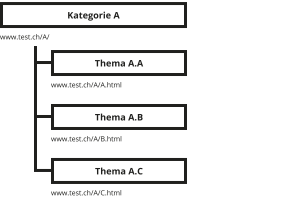
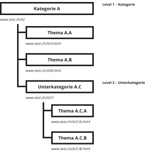
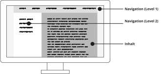
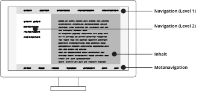
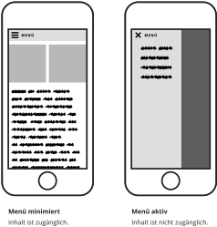

import Margin from 'gatsby-theme-signalwerk/src/components/Margin';
import Grid from 'gatsby-theme-signalwerk/src/components/Grid';
import Column from 'gatsby-theme-signalwerk/src/components/Column';
import Box from 'gatsby-theme-signalwerk/src/components/Box';

## Strukturieren der Inhalte in Seiten
Die meisten Websites gliedern Inhalte über Seiten. Meist wird auf einer Seite ein Thema, Artikel oder eine Einheite erläutert. Davon ausgehend werden dann Links und Bezüge zu anderen Seiten geschaffen.

### Mehrere Inhalte auf mehreren Seiten
 

## Anwachsen der Themen ohne Struktur zu unterstützen
Wird ein Thema grösser, so können verschiedene Konzepte gewählt werden, wie nun die Information weiter strukturiert wird. Meist ungünstig ist eine Aufteilung, die eine bestehende Struktur nur aufteilt, ohne aber den Benutzer weiter in der Struktur zu unterstützen.

<Margin background>

### Probleme

Inhalte werden in kleinere Teile verteilt, jedoch wird die Struktur der Inhalte nicht Unterstützt. Der User scheint eher verloren.

</Margin>

## Anwachsen der Themen mit erweiterter Struktur
Wachsen einzelne Themen an, können auch Kategorien gebildet werden und somit eine Gruppierung der Inhalte. Damit wird eine zusätzliche Strukturtiefe eingezogen, jedoch mit dem Ziel die Struktur zu verstärken.

### Logische Einheiten
Die Hauptkategorie umfasst mehrere Themen.

### Strukturtiefe
Je mehr Inhalte in Kategorien zusammen gefasst werden müssen, desto eher entsteht das Bedürfnis, mehr Kategorien und Unterkategorien zu erstellen.

### Unterkategorien
Bei Webdesign spricht man von Levels, in die sich eine Struktur einteilen kann.

## Hierarchische Navigation
Viele kleinere Websites lassen sich sehr einfach über ein oder zwei Menü-Tiefen (Menü-Levels) steuern.

 
 

<Grid>

</Grid>

## Hierarchische Inhalte darstellen
Es gibt diverse Ansätze um hierarchische Inhalte in einer Navigation ab zu bilden. Die Konzepte sind jedoch oftmals ähnlich.

### Abtrennen der Levels
Separate Navigations-Levels sind an verschiedenen Positionen angeordnet und optisch getrennt.

### Verschachtelte Levels
Die Navigation besteht aus einer Einheit. Durch einrücken wird die jeweilige nächste Navigationstiefe angezeigt.

### Breadcrumb-Navigation (Brotkrümelnavigation)
Kommen diverse Hierarchien innerhalb der Seite vor, wird häufig eine Breadcrumb-Navigation dem Benutzer zusätzlich eingeblendet, so dass dieser immer Sieht, in welcher Kategoire und Unterkategorie er gerade ist und gegebenen Falles auch in der Hierarchie wieder zurück springen kann.

## Metanavigation
Bei einer Metanavigation werden nicht die Hierarchien innerhalb der Seite berücksichtig, sondern es werden gewisse Teile des Inhalts bewusst gewählt und zusammen als separate Navigation ausgegeben.
Oft wird eine Metanavigation zur hierarchischen Navigation ergänzt.

<Grid>

</Grid>

### Optische Abtrennung von Hierarchie-Navigation
Um dem Benutzer die Metanavigation verständlicher zu machen, wird diese oftmals optisch abgetrennt.

## Zeitliche Navigation
Werden viele Inhalte ohne erkennbare Struktur dargestellt, so kann eine Zeitliche Navigation – sofern der Inhalt dies zulässt – angebracht sein. Meist ist bei einer derartigen Navigation der aktuellste Eintrag (häufig nicht in Seiten strukturiert) am einfachsten zugänglich als am Anfang und weitere Einträge folgen durch eine Navigation.

 

 

### Timeline
Durch Scrollen oder verlinkung gelangt man zu den älteren Inhalten.
Häufig werden Blogs oder Posts in sozialen Netzwerken mit absteigendem Datum sortiert.

## Scroll-Navigation (Anker)
Bei Seiten mit überschaubarem Inhalt, kann es sein, dass mehrere Themen auf einer einzelnen Seite angeordnet werden. Die Navigation erfollt dann innerhalb der Seite nur durch scrollen. Um Themen direkt an zu springen, kann auch eine Text-Navigation zusätzlich eingeblendet sein.

### Inhalte fortlaufend
Bei einer solchen Navigation sind die Inhalte nicht durch Seiten, sondern über die Position getrennt.
Die Navigation erfolgt dennoch über ein Menü, doch es wird kein Seitenwechsel, sondern ein Scroll ausgelöst.

 

### Storrytelling durch scroll (scrollytelling)
Im Bereich des Journalismus gibt es diverse Ansätze durch die Interaktivon des scrollens eine journalistische Geschichte einfacher zugänglich zu machen. Solch aufbereitete Seiten entstehen oft ausserhalb des üblichen redaktionellen Prozesses und werden technisch und inhaltlich auf diese Art der Navigation optimiert. Dieses Format wurde massgeblich durch den [«Snow Fall»-Artikel der NYT](https://www.nytimes.com/projects/2012/snow-fall/index.html#/?part=tunnel-creek) begründet.

## Navigation auf mobilen Geräten
Um auf den kleinen Bildschirmen der mobilen Geräte nicht viel Platz durch die Navigation zu verlieren, wird das Menü meist vereinfacht und erst bei Anwahl des Menüs vollständig zugänglich gemacht.

### Hamburger-Menü mit Slideout
Als häufiges Symbol für die Navigation werden drei Striche verwendet. Damit das Icon auch von weniger netzaffinen Personen klar erkennt werden kann, empfiehlt sich dies zusätzlich an zu schreiben.
Das Menü bewegt sich von der Seite in den Bildschirm.

## Weiterführende Informationen

### Navigationen nach Zeit
* [holgi – Flickr](https://www.flickr.com/photos/holgi/)
* [Balthasar Glättli – Twitter](https://twitter.com/bglaettli)
* [Facebook](https://de-de.facebook.com/Zukkihund)

### Scroll-Navigation
* [New York Philharmonic](http://nyphil.org/files/biennial/index.html)
* [Smint – jQuery plugin](http://www.outyear.co.uk/smint/demo/)

### Storrytelling durch scroll
* [Snow Fall – Multimedia Feature - NYTimes.com](http://www.nytimes.com/projects/2012/snow-fall/)
* [Monet im Städel Museum Frankfurt](http://monet.staedelmuseum.de)
* [Iouri Podladtchikov – NZZ.ch](http://iouri-in-sotschi.nzz.ch/en/)
* [The Needle Trauma – tagesanzeiger.ch](http://www.tagesanzeiger.ch/extern/storytelling/platzspitz/)
* [Paul Ford: What Is Code? – Bloomberg](http://www.bloomberg.com/graphics/2015-paul-ford-what-is-code/)

### Aktuelle Web-Trends
* [Grimme Online Award](http://www.grimme-online-award.de)

 
 
 

### Autor
Stefan Huber  
sh@signalwerk.ch  
+41 78 744 37 38

### Dokumentgeschichte
Juni 2014: Erstellung  
September 2015: Anpassung  
März 2017: Erweiterung  
September 2020: Überarbeitung  

 
 
