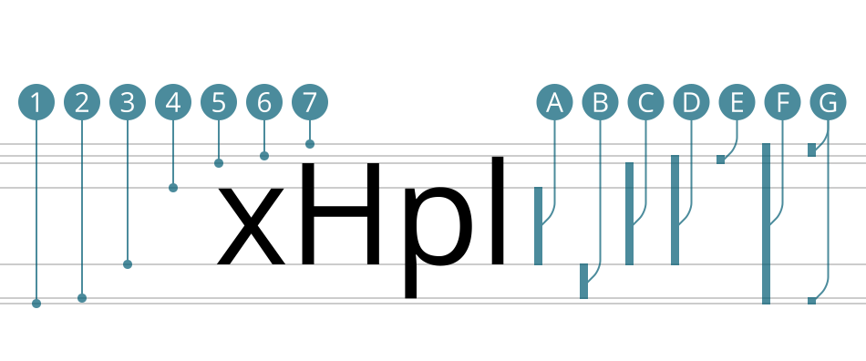
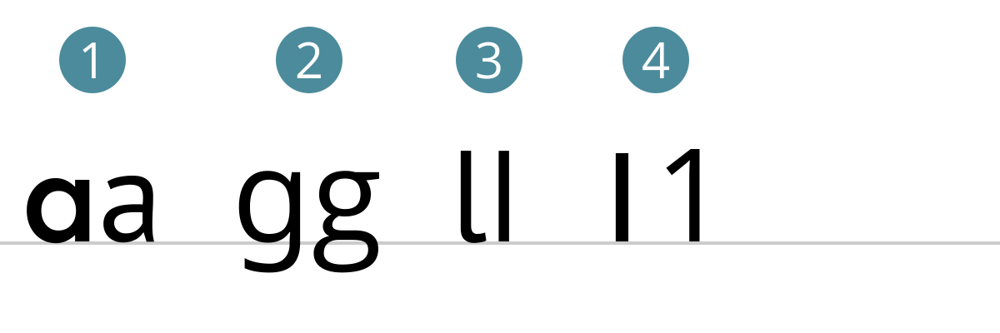

import Margin from 'gatsby-theme-signalwerk/src/components/Margin';
import Grid from 'gatsby-theme-signalwerk/src/components/Grid';
import Column from 'gatsby-theme-signalwerk/src/components/Column';
import Box from 'gatsby-theme-signalwerk/src/components/Box';
import './styles.css';

## Vierliniensystem

Die lateinische Schrift basiert auf einem so genannten Vierliniensystem. Alle Schriftzeichen des Alphabet orientieren sich an der Schriftlinie und haben maximal zwei weitere Linien, an denen Sie sich orientieren.

<Grid>

<Column start="1" end="7">

1. Kegelunterkante · CSS: `text-bottom`
2. p-Linie (Decenderline, beardline)
3. Schriftlinie, Grundlinie (Baseline) · CSS: `baseline`
4. x-Linie, Mittellinie (x-line)
5. H-Linie, Versallinie (Cap line)
6. k-Linie (Acenderline)
7. Kegeloberkante · CSS: `text-top`

</Column>

<Column start="7" end="13">

1. x-Höhe, Mittellänge (x-Height)
2. Unterlänge, Unterhöhe (Decender depth)
3. Versalhöhe (Cap height)
4. Oberlänge (Acender height)
5. Überhang (Overshoot)
6. Vertikaler Raumbedarf, Kegelgrösse, Schriftgrösse (Font Size, em)
7. Fleisch (buffer space, shoulder)

</Column>

</Grid>

## Anatomie der Buchstaben

<Grid>

<Column start="1" end="9">

</Column>

<Column start="9" end="13">

1. Anstrich
2. geschlossener Punze
3. offener Punze
4. Ohr, Fähnchen
5. Abstrich
6. Schulter

</Column>

</Grid>

<Grid>

<Column start="1" end="9">

</Column>

<Column start="9" end="13">

1. Stamm, Grundstrich
2. Haarstrich
3. Serife
4. Anstrich/Dachansatz
5. Halbserife
6. Schleife
7. Achslage

</Column>

</Grid>

## Spezielle Buchstabenformen

<Grid>

<Column start="1" end="9">

</Column>

<Column start="9" end="13">

1. Einstöckiges a | Zweistöckiges a
2. Zweistöckiges g | Dreistöckiges g
3. Krückstock l (Erik Spiekermann) | normales l
4. Amerikanische 1 | Europäische 1

</Column>

</Grid>

<Grid>

<Column start="1" end="9">

</Column>

<Column start="9" end="13">

</Column>

</Grid>

<Grid>

<Column start="1" end="5">

</Column>

<Column start="5" end="13">

</Column>

</Grid>

### CSS
Objekte in HTML können mittels CSS an der Schrift ausgerichtet werden.

  <code>vertical-align: baseline; </code>
  <code>vertical-align: text-top; </code>
  <code>vertical-align: text-bottom; </code>

## Weiterführende Informationen

### Technik
* [Panose Werte](https://twitter.com/ellmerstefan/status/934190602421448705/photo/1)

 
 
 

### Autor
Stefan Huber  
sh@signalwerk.ch  
+41 78 744 37 38

### Dokumentgeschichte
März 2018: Erstellung  
Februar 2020: Überarbeitung  

 
 
